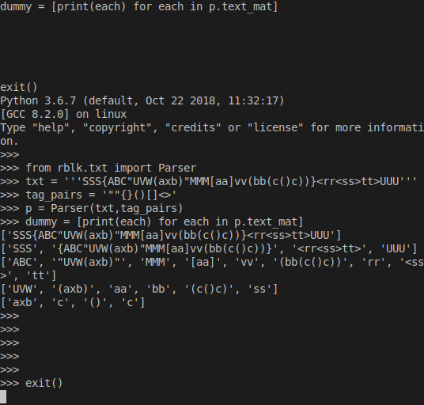
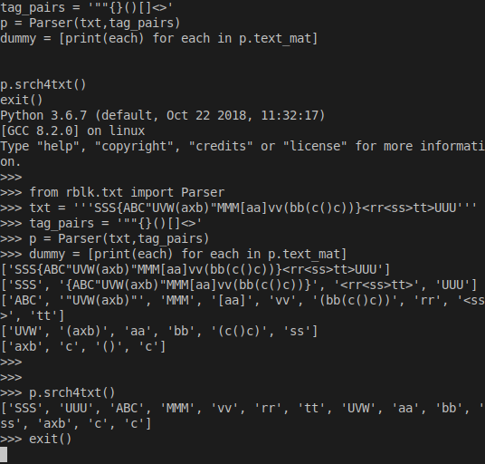
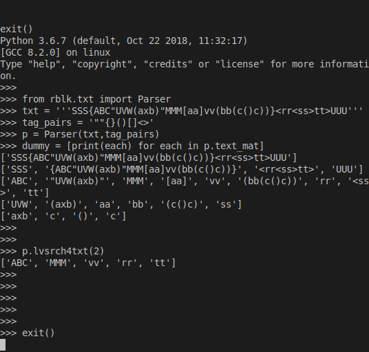
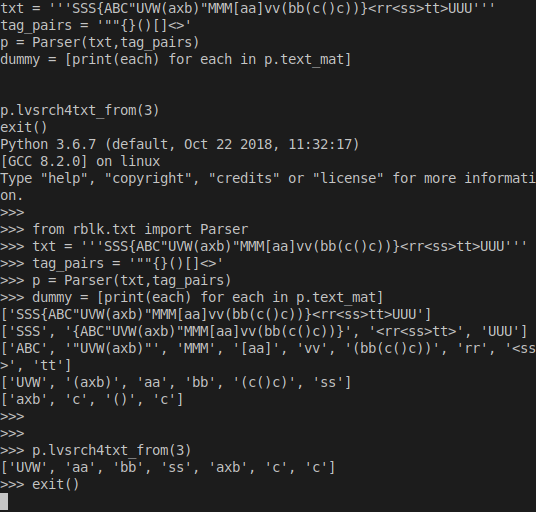
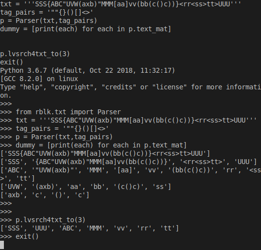
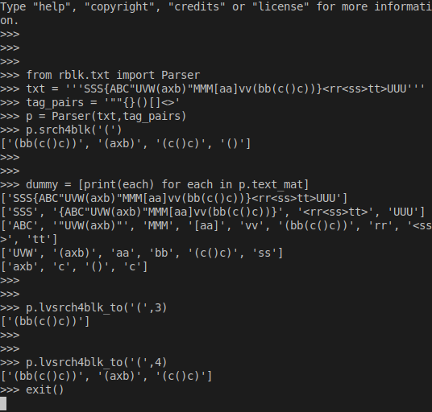
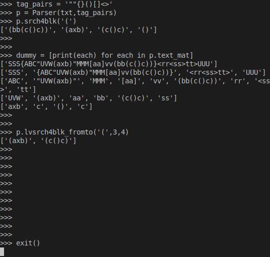
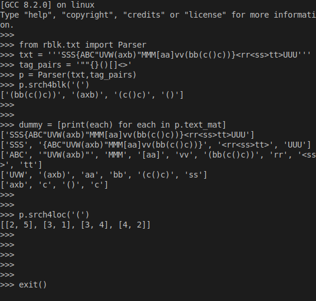
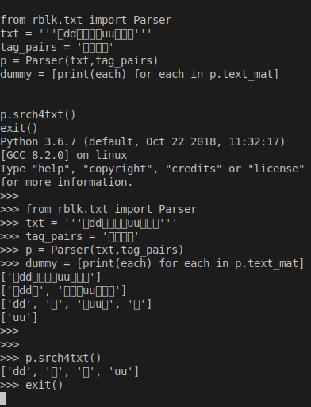

Usage
=====

0. parser
---------

    ::
    
        from xdict.jprint import pobj,pdir
        from rblk.txt import Parser
        txt = '''SSS{ABC"UVW(axb)"MMM[aa]vv(bb(c()c))}<rr<ss>tt>UUU'''
        tag_pairs = '""{}()[]<>'
        p = Parser(txt,tag_pairs)
        pdir(p,range=[-10,-1])
        p.txt
        p.breadths
        p.depth
        
        
        
        

1. text_mat
-----------

    ::
    
        from rblk.txt import Parser
        txt = '''SSS{ABC"UVW(axb)"MMM[aa]vv(bb(c()c))}<rr<ss>tt>UUU'''
        tag_pairs = '""{}()[]<>'
        p = Parser(txt,tag_pairs)
        dummy = [print(each) for each in p.text_mat]
        
        
        

2. srch4txt()
-------------

    ::
    
        from rblk.txt import Parser
        txt = '''SSS{ABC"UVW(axb)"MMM[aa]vv(bb(c()c))}<rr<ss>tt>UUU'''
        tag_pairs = '""{}()[]<>'
        p = Parser(txt,tag_pairs)
        dummy = [print(each) for each in p.text_mat]
        
        p.srch4txt()

3. lvsrch4txt(lv)
-----------------

    ::
    
        from rblk.txt import Parser
        txt = '''SSS{ABC"UVW(axb)"MMM[aa]vv(bb(c()c))}<rr<ss>tt>UUU'''
        tag_pairs = '""{}()[]<>'
        p = Parser(txt,tag_pairs)
        dummy = [print(each) for each in p.text_mat]
        
        p.lvsrch4txt(2)
        
        
        

4. lvsrch4txt_from(from_lv)
---------------------------

    ::
    
        from rblk.txt import Parser
        txt = '''SSS{ABC"UVW(axb)"MMM[aa]vv(bb(c()c))}<rr<ss>tt>UUU'''
        tag_pairs = '""{}()[]<>'
        p = Parser(txt,tag_pairs)
        dummy = [print(each) for each in p.text_mat]
        
        p.lvsrch4txt_from(3)

5. lvsrch4txt_to(to_lv)
-----------------------

    ::
    
        from rblk.txt import Parser
        txt = '''SSS{ABC"UVW(axb)"MMM[aa]vv(bb(c()c))}<rr<ss>tt>UUU'''
        tag_pairs = '""{}()[]<>'
        p = Parser(txt,tag_pairs)
        dummy = [print(each) for each in p.text_mat]
        
        p.lvsrch4txt_to(3)

6. lvsrch4txt_fromto(from_lv,to_lv)
-----------------------------------

    ::
    
        from rblk.txt import Parser
        txt = '''SSS{ABC"UVW(axb)"MMM[aa]vv(bb(c()c))}<rr<ss>tt>UUU'''
        tag_pairs = '""{}()[]<>'
        p = Parser(txt,tag_pairs)
        dummy = [print(each) for each in p.text_mat]
        
        p.lvsrch4txt_fromto(2,3)

7. srch4blk(tag)
----------------

    ::
    
        print("<two reserved tags null and root> null:txt-without-block  root:original-txt")
        from rblk.txt import Parser
        txt = '''SSS{ABC"UVW(axb)"MMM[aa]vv(bb(c()c))}<rr<ss>tt>UUU'''
        tag_pairs = '""{}()[]<>'
        p = Parser(txt,tag_pairs)
        p.srch4blk('<')
        
        p.srch4blk('(')
        
        p.srch4blk('[')
        
        p.srch4blk('{')
        
        p.srch4blk('"')
        
        p.srch4blk("null")
        
        p.srch4blk("root")

8. lvsrch4blk(tag,lv)   
------------------------

    ::
    
        from rblk.txt import Parser
        txt = '''SSS{ABC"UVW(axb)"MMM[aa]vv(bb(c()c))}<rr<ss>tt>UUU'''
        tag_pairs = '""{}()[]<>'
        p = Parser(txt,tag_pairs)
        p.srch4blk('(')
        
        dummy = [print(each) for each in p.text_mat]
        
        p.lvsrch4blk('(',3)
        
        
        
        
        

9. lvsrch4blk_from(tag,from_lv)   
----------------------------------

    ::
    
        from rblk.txt import Parser
        txt = '''SSS{ABC"UVW(axb)"MMM[aa]vv(bb(c()c))}<rr<ss>tt>UUU'''
        tag_pairs = '""{}()[]<>'
        p = Parser(txt,tag_pairs)
        p.srch4blk('(')
        
        dummy = [print(each) for each in p.text_mat]
        
        p.lvsrch4blk_from('(',3)
        
        p.lvsrch4blk_from('(',4)

.. image:: ./images/lvsrch4blk_from.svg

10. lvsrch4blk_to(tag,to_lv) 
-----------------------------

    ::
    
        
        from rblk.txt import Parser
        txt = '''SSS{ABC"UVW(axb)"MMM[aa]vv(bb(c()c))}<rr<ss>tt>UUU'''
        tag_pairs = '""{}()[]<>'
        p = Parser(txt,tag_pairs)
        p.srch4blk('(')
        
        dummy = [print(each) for each in p.text_mat]
        
        p.lvsrch4blk_to('(',3)
        
        p.lvsrch4blk_to('(',4)

11. lvsrch4blk_fromto(tag,from_lv,to_lv)
----------------------------------------

    ::
    
        
        from rblk.txt import Parser
        txt = '''SSS{ABC"UVW(axb)"MMM[aa]vv(bb(c()c))}<rr<ss>tt>UUU'''
        tag_pairs = '""{}()[]<>'
        p = Parser(txt,tag_pairs)
        p.srch4blk('(')
        
        dummy = [print(each) for each in p.text_mat]
        
        p.lvsrch4blk_fromto('(',3,4)
        
        
        
        
        
        

12. srch4loc(tag)
-----------------

    ::
    
        from rblk.txt import Parser
        txt = '''SSS{ABC"UVW(axb)"MMM[aa]vv(bb(c()c))}<rr<ss>tt>UUU'''
        tag_pairs = '""{}()[]<>'
        p = Parser(txt,tag_pairs)
        p.srch4blk('(')
        
        dummy = [print(each) for each in p.text_mat]
        
        p.srch4loc('(')
        
        
        

13. non-symmetric-tag_pairs
---------------------------

    ::
    
        
        from rblk.txt import Parser
        txt = '''{ddd@#ddd>'''
        tag_pairs = '{@#>'
        p = Parser(txt,tag_pairs)
        dummy = [print(each) for each in p.text_mat]

.. image:: ./images/non-symmetric-tag_pairs.svg

14. chinese-tag_pairs
---------------------

    ::
    
        from rblk.txt import Parser
        txt = '''的dd的【人【uu】人】'''
        tag_pairs = '的的【】'
        p = Parser(txt,tag_pairs)
        dummy = [print(each) for each in p.text_mat]
        
        p.srch4txt()

